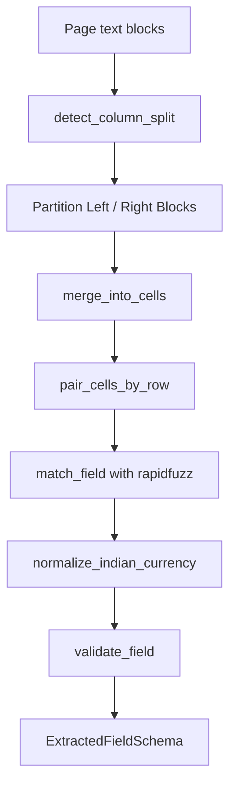

# GeM Parent Tender Extraction — Spatial Key-Value Engine

This document provides a technical guide to the spatial key-value pairing extraction engine implemented for Government e-Marketplace (GeM) parent bid documents (Stage 1).

## Technical Overview

The GeM parent tender parser is designed to extract fields from the highly structured bilingual tables generated by the GeM portal. Instead of relying on keyword searches over flat, layout-agnostic text lines, this engine operates on the two-dimensional spatial geometry of text blocks generated by OCR engines.

## Key Algorithms

### 1. Dynamic Column Split Detection (`detect_column_split`)
Rather than using hardcoded width split values, the engine dynamically calculates the separation line between the labels (left) and values (right) columns.
- Gaps are calculated between sorted `x1` coordinates of all text blocks.
- The largest gap occurring in the middle 20% to 80% range of the page is selected as the column splitter.
- This ensures the algorithm is robust to varying scan resolutions, margins, and DPI levels.

### 2. Layout-Aware Cell Merging (`merge_into_cells`)
To handle labels or values that wrap across multiple lines, consecutive text blocks in the same column are merged into a single cell if their vertical distance is within `y_gap_tolerance` (20px). This consolidates multi-line content into single logical values before pairing.

### 3. Y-Overlap Row Pairing (`pair_cells_by_row`)
Wrapped cells of differing heights do not share identical `y1` coordinates. The engine pairs left-column cells to right-column cells based on the vertical overlap of their bounding boxes:
$$\text{overlap} = \min(y_{2,\text{left}}, y_{2,\text{right}}) - \max(y_{1,\text{left}}, y_{1,\text{right}})$$
The right-column cell with the largest vertical overlap is paired with the left cell.

### 4. Section-Scoped Fuzzy Matching (`match_field`)
- **Fuzzy Matching**: Labels are compared against anchors using `rapidfuzz.fuzz.partial_ratio`. This handles minor OCR spelling/glyph errors and bilingual label text (Hindi/English).
- **Hindi Suffix Stripping**: Hindi glyphs (Devanagari range `[\u0900-\u097F]`) are stripped from labels before matching to boost the match confidence of English keywords.
- **Section Namespacing**: Section headers (e.g. `EMD Detail`, `ePBG Detail`) are tracked down the page by y-coordinate. Labels (like `"Advisory Bank"`) are matched only if they exist in the correct section, resolving structural ambiguities.

### 5. Multi-Schedule Segmentation (`segment_by_schedule`)
Pages are partitioned into separate schedules if they contain schedule headers.
- **Schedule Header Filtering**: Text starting with `"Schedule \d+"` is filtered out if it contains field terms (like `"EMD"`, `"Amount"`, `"Quantity"`), preventing standard rows from acting as schedule segment boundaries.
- **Field Aggregation**: EMD amounts and quantities are collected per-schedule and aggregated as a post-processing step rather than during parsing.

### 6. Validation and Normalization
- **Currency Normalization**: Indian currency text (e.g. `15 Lakh`, `2.5 Crore`, `₹ 43,000`, `50,000/-`) is normalized into digit-only values (`1500000`, `25000000`, `43000`, `50000`).
- **Strict Validation**: Normalized values are validated against specific patterns (e.g. date format, digits, percentages). If validation fails, `value` is set to `None` and `needs_review` is set to `True` (no guessing).

## Out-of-Scope (Stage 2 Deferral)
Tender details that do not exist inside the GeM parent PDF (e.g., eligibility years, net worth, solvency, LD percentages) are deliberately excluded from this parser's map and return empty stubs with a `likely_source: atc_pdf` indicator, signaling they must be parsed in the Stage 2 (ATC PDF) extraction phase.
