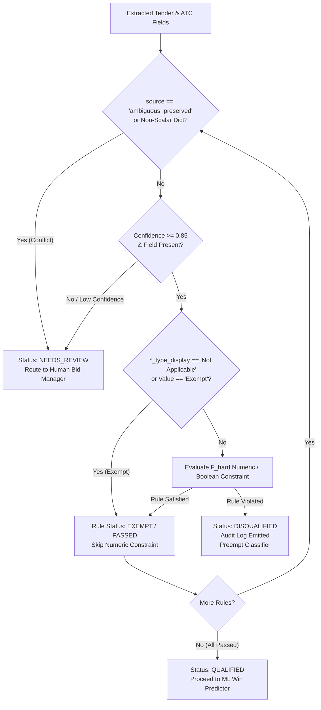

# Week 7 Specification: Hard Compliance Filter ($F_{\text{hard}}$) & Risk Routing

## 1. Executive Summary & Architectural Position
The Hard Compliance Filter ($F_{\text{hard}}$) operates as a deterministic, pre-classifier gate in the bid decision pipeline. Before any tender reaches the Machine Learning win-probability classifier (LightGBM) or Groq synthesis layers, $F_{\text{hard}}$ evaluates mandatory statutory, financial, technical, and operational eligibility constraints.



---

## 2. Hard Rule Gating Invariants & Routing Protocols

### 2.1 Confidence Gating & Low-Confidence Protection
> **Any $F_{\text{hard}}$ rule whose input field is `MISSING`, `None`, empty string (`""`), or extracted with compound confidence below the Week 6 threshold (`confidence < 0.85`) MUST route the tender to `NEEDS_REVIEW` compliance status — NEVER to an automatic `DISQUALIFIED`.**

- **Rationale**: An extraction ambiguity, scanned table degradation, or unparsed ATC annexure must never prematurely reject a viable commercial opportunity.
- **Routing Action**:
  - `compliance_status = ComplianceStatus.NEEDS_REVIEW`
  - `review_reasons.append(f"Low confidence ({field_conf:.2f} < 0.85) or missing value for mandatory rule '{rule_name}' on field '{field_name}'")`

---

## 2.5 Sentinel Field States (Exemptions & Preserved Ambiguities)

The confidence-gating invariant alone does not cover sentinel and composite field states that arise from domain extraction rules. $F_{\text{hard}}$ must handle two specific sentinel states before any boolean comparison executes:

### 1. Exemption Handling ("Not Applicable" 3rd State)
> **Before any numeric/boolean $F_{\text{hard}}$ rule evaluates a field, it must first check the field's paired `_type_display` companion (e.g. `avg_annual_turnover_type_display`) for `"Not Applicable"`. If exempt, the rule passes automatically — it must never numerically compare an exemption's `"₹0.00"` placeholder against a minimum threshold and disqualify on it.**

- **Rationale**: When BEC explicitly exempts financial criteria, the pipeline accurately extracts `avg_annual_turnover_type_display = "Not Applicable"` and sets `avg_annual_turnover_value_display = "₹0.00"`. Because this extraction is accurate and high-confidence, a confidence gate would not catch it; a naive numeric comparison (`₹0.00 >= threshold`) would falsely disqualify a compliant, exempt bidder.
- **Protocol**:
  ```python
  if type_display in ("Not Applicable", "Exempt", "NA", "N/A"):
      return RuleResult(status=RuleStatus.EXEMPT, passed=True, reason="Criteria explicitly exempt in tender BEC")
  ```

### 2. Ambiguous-Preserved Fields (Composite Dictionaries)
> **Any field whose `source == "ambiguous_preserved"` (a `{"main_tender": val, "atc": val}` dict rather than a scalar) must route to `NEEDS_REVIEW`, identically to missing/low-confidence fields, before it reaches any $F_{\text{hard}}$ boolean comparison. Never evaluate a rule against the raw dict.**

- **Rationale**: Multi-source fields with unresolvable inter-document discrepancies are preserved as dictionaries. Passing a dictionary directly into scalar comparisons (`dict >= float`) causes runtime `TypeError` crashes or erroneous evaluations.
- **Routing Action**:
  - `compliance_status = ComplianceStatus.NEEDS_REVIEW`
  - `review_reasons.append(f"Unresolved multi-source document conflict for field '{field_name}': main_tender vs atc")`
  - Preempts boolean evaluation and holds automated disqualification until a human tender manager resolves the conflict.

---

---

## 3. Structured Audit Logging Protocols

Every compliance decision emitted by $F_{\text{hard}}$ must emit a standardized, structured audit log entry to allow human auditors to inspect and spot-check decisions in bulk:

### 3.1 Disqualification Audit Log (`[HARD_FILTER_DISQUALIFIED]`)
```text
[HARD_FILTER_DISQUALIFIED] Tender: {tender_no} | Rule: {rule_name} | Field: {field_name} | Extracted Value: {extracted_val!r} | Extracted Confidence: {confidence:.2f} | Constraint: {constraint_threshold!r} | Reason: {disqualification_reason}
```

- `[HARD_FILTER_DISQUALIFIED] Tender: GEM/2026/B/7317018 | Rule: MAX_PBG_PERCENTAGE | Field: 'pbg_percentage' | Extracted Value: 12.5 | Extracted Confidence: 0.95 | Constraint: '<= 10.0%' | Reason: Required PBG of 12.5% exceeds statutory cap of 10.0%`
- `[HARD_FILTER_DISQUALIFIED] Tender: GEM/2025/B/6232822 | Rule: MIN_BID_VALIDITY | Field: 'bid_validity_days' | Extracted Value: 30 | Extracted Confidence: 1.00 | Constraint: '>= 60 days' | Reason: Bid validity of 30 days is below minimum operational buffer of 60 days`

### 3.2 Unconstrained Buyer-Optional Audit Log (`[HARD_FILTER_UNCONSTRAINED]`)
When a buyer omits an optional clause (e.g. turnover, working capital, PBG, experience) from the RFP entirely:
```text
[HARD_FILTER_UNCONSTRAINED] Tender: {tender_no} | Rule: {rule_name} | Field: {field_name} | Reason: No constraint mandated by buyer in tender
```

### 3.3 Section-Absence vs Blank-Field-in-Found-Section Distinction
- **Section Omitted in Document**: The clause was never included in the tender document by the buyer $\rightarrow$ Evaluates to `QUALIFIED` with `[HARD_FILTER_UNCONSTRAINED]` log.
- **Blank Field within Found Section**: The section/table exists in the document (e.g. `ePBG Detail` or `Turnover Criteria` row detected), but the value cell is empty, corrupted, or unextracted $\rightarrow$ Evaluates to `NEEDS_REVIEW` (`reason="Field within found document section was blank or unextracted"`).

---

## 4. Mandatory Ground-Truth Verification Protocol (Pre-Wiring)

Before $F_{\text{hard}}$ is connected upstream of the LightGBM classifier in the live production pipeline:

1. **Mandatory Gold-Standard Suite Execution**:
   - All boolean compliance functions must be verified against the **actual 10 gold-standard tenders** defined in [`tests/integration/test_gem_extraction_accuracy.py`](file:///c:/Users/Asus/Desktop/Tender_Volks/main/tests/integration/test_gem_extraction_accuracy.py):
     1. `GEM/2026/B/7317018`
     2. `GEM/2025/B/6232822`
     3. `GEM/2025/B/6246461`
     4. `GEM/2025/B/6263705`
     5. `GEM/2025/B/6620282`
     6. `GEM/2025/B/6630054`
     7. `GEM/2025/B/6748709`
     8. `GEM/2025/B/6782142`
     9. `GEM/2025/B/6902559`
     10. `GEM/2025/B/6960382`
2. **Prohibition on Synthetic-Only Verification**:
   - Synthetic unit-test mocks are insufficient for verifying $F_{\text{hard}}$ wiring. Real multi-page GeM field outputs (with their real EMD splits, advisory banks, and exempt financial criteria) must be fed directly through $F_{\text{hard}}$ to verify zero false disqualifications.
